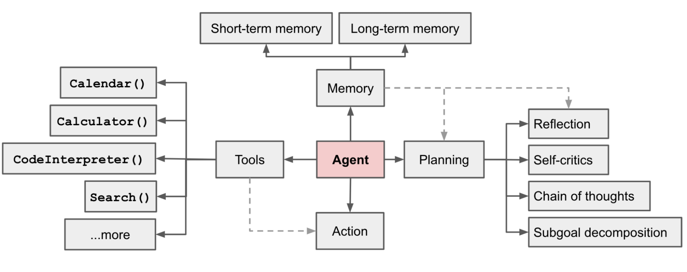

# Agent 核心要素：Tool Use

## 背景
OpenAI 在 [“A pratical guide to building agents”](../../../docs/pdf/a-practical-guide-to-building-agents.pdf) 一文中，对 Agent 的定义如下：

> 它具备与外部系统进行交互并使用各种工具的能力：即既能收集信息，也能采取相应行动。并且能够根据工作流的当前状态选择合适的工具，并始终在明确规定的限制范围内运行。

LLM 时代的 Agent 通常指的是**以 LLM 驱动的自主智能体系统**，社区内[^1]大家通常对它定义了四个关键组件（见下图）：规划（Planning）、Memory（记忆）、Tool Use（工具使用）、行动（Action）。



通常来说，工具使用（Tool Use）包含三种类型：
| 类型   | 描述                                                         | 示例                                     |
|--------|------------------------------------------------------------|------------------------------------------|
| 数据   | 使Agent能够获取执行工作流所需的相关背景信息和数据。         | 查询交易数据库或系统、阅读PDF文档或网路搜索。|
| 行动   | 使Agent能够与系统进行交互，从而能够执行诸如向数据库添加新信息、更新记录或发送消息等操作。| 发送电子邮件和短信，更新数据库记录，将工单转交给人工处理。|
| 编排   | Agent本身也可以成为其他Agent的工具。                       | 退款Agent、研究Agent、写作Agent。         |

**为什么需要 Tool Use？**<br>
尽管模型训练的语料数据不断扩增，但你并不能保证模型能学习到所有事情，就像他并不知道你一样（也许）。特别是在非常垂类的领域，该领域的数据过分稀缺，即模型内部知识不够时（比如在 Pretrain 阶段时不存在该数据，且之后没法改变模型的权重），那么通过调用外部 API 就能很好地解决这个问题。比如获取实时信息（联网检索）、访问专有的信息知识库（RAG）等。<br>
<br>
此外，信息量是在不断更新和增长的，现有的模型没办法不通过任何工具和历史上下文就能了解到今天发生了什么。额外，有许多业务需求需要 Agent 能够返回足够可信、准确的信息或数据（例如金融、科学计算等）。这个时候，`Text2SQL`、`Text2Code` 等工具就显得尤为重要，前者用于将自然语言转换为 SQL 查询，与内部数据库进行交互；后者用于将自然语言转换为可解释的执行代码。

## 快速开始
### 1. 申请 Tavily API KEY：
在该示例中，我们将使用 Tavily（一个搜索引擎）作为工具，它有每月 1000 次的免费搜索额度。要使用它，你需要访问 [Tavily 官网](https://app.tavily.com/sign-in) 获取 API KEY。
> 当然，你也可以使用其它免费搜索工具，如 DuckDuckGo、Brave Search 等。

### 2. 安装依赖
```bash
# 已默认你安装了 langchian、langgraph 等其他依赖。
$ pip install -U langchain-tavily
```

### 3. 设置环境变量
```bash
$ cp .env.example .env
```
在 `.env` 文件中设置 `OPENAI_API_KEY` 和 `OPENAI_BASE_URL`，以及 `TAVILY_API_KEY`。
```bash
TAVILY_API_KEY="..."
OPENAI_BASE_URL="..."
OPENAI_API_KEY="..."
```

### 4. 运行代码
```bash
$ python run_langchain.py # 基于 LangChain 的实现
$ python run_langgraph.py # 基于 LangGraph 的实现
```

## 基本方法解析
### 核心点一：定义工具
我们首先需要创建我们想要使用的工具。在本实例中，以 Tavily——一个搜索引擎为例。在 LangChain 中，已经内置实现了 Tavily 的工具，我们只需要导入 `langchain-tavily` 集成包即可，整个过程非常 Easy！
```python
# 如要运行，记得通过 dotenv 加载环境变量
from langchain_tavily import TavilySearch

search = TavilySearch(max_results=2)
search_results = search.invoke("What is the weather in Beijing")
print(search_results)
```
**示例输出:**
```json
{
  "query": "What is the weather in Beijing",
  "follow_up_questions": null,
  "answer": null,
  "images": [],
  "results": [
    {
      "title": "Weather in Beijing",
      "url": "https://www.weatherapi.com/",
      "content": "{'location': {'name': 'Beijing', 'region': 'Beijing', 'country': 'China', 'lat': 39.9289, 'lon': 116.3883, 'tz_id': 'Asia/Shanghai', 'localtime_epoch': 1752929004, 'localtime': '2025-07-19 20:43'}, 'current': {'last_updated_epoch': 1752928200, 'last_updated': '2025-07-19 20:30', 'temp_c': 28.2, 'temp_f': 82.8, 'is_day': 0, 'condition': {'text': 'Light rain', 'icon': '//cdn.weatherapi.com/weather/64x64/night/296.png', 'code': 1183}, 'wind_mph': 2.5, 'wind_kph': 4.0, 'wind_degree': 325, 'wind_dir': 'NW', 'pressure_mb': 1003.0, 'pressure_in': 29.62, 'precip_mm': 0.04, 'precip_in': 0.0, 'humidity': 84, 'cloud': 0, 'feelslike_c': 28.5, 'feelslike_f': 83.4, 'windchill_c': 31.2, 'windchill_f': 88.1, 'heatindex_c': 32.6, 'heatindex_f': 90.6, 'dewpoint_c': 17.9, 'dewpoint_f': 64.3, 'vis_km': 10.0, 'vis_miles': 6.0, 'uv': 0.0, 'gust_mph': 3.7, 'gust_kph': 6.0}}",
      "score": 0.8558139,
      "raw_content": null
    },
    {
      "url": "https://www.weather25.com/asia/china/shanxi/beijing?page=month&month=July",
      "title": "Beijing weather in July 2025 - Weather25.com",
      "content": "Beijing weather in July 2025 | Beijing 14 day weather Beijing Image 3: weather in China Beijing weather in July 2025 The average weather in Beijing in July The weather in Beijing in July is very hot. You can expect about **3 to 8 days of rain** in Beijing during the month of July. Temperatures in Beijing in July Weather in Beijing in July - FAQ What is the average temperature in Beijing in July? The average temperature in Beijing in July is 73/93° F. On average, there are 6 rainy days in Beijing during July. The weather in Beijing in July is ok. On average, there are 0 snowy days in Beijing in July. More about the weather in Beijing",
      "score": 0.82425016,
      "raw_content": null
    }
  ],
  "response_time": 1.61
}
```

### 核心点二：创建自定义工具
在大部分时候，你可能想要自定义工具来扩展更多的功能。参考：[how-to-create-tools.md](../../../docs/guide/how-to-create-tools.md)

### 核心点三：创建 Agent
在定义了工具和LLM，就可以进行 Agent 的创建：
```python
from langgraph.prebuilt import create_react_agent

agent_executor = create_react_agent(model, tools)
```

### 核心点四：创建 `StateGraph`
一个 `StateGraph` 对象定义了我们聊天机器人的结构，作为一个“状态机”。我们可以通过添加 `nodes` 来表示 LLM 可以调用的函数，并添加 `edges` 来指定机器人如何在这些函数之间进行转换。
```python
from typing import Annotated
from typing_extensions import TypedDict
from langgraph.graph import StateGraph, START, END
from langgraph.graph.message import add_messages

class State(TypedDict):
    # Messages 被指定为 list 类型；
    # add_messages 是一种 Reducer 函数，定义了状态键如何被更新；
    # 在该例子中，它会被追加进列表，而不是覆盖。
    messages: Annotated[list, add_messages]

graph_builder = StateGraph(State)
```
现在该图可以处理两个关键任务：<br>
1. 每个 node 可以接收当前 State 作为输入并输出状态更新；<br>
2. 由于使用了带有 Annotated 语法的预建 add_messages 函数，messages 的更新将附加到现有列表而不是覆盖它。

### 核心点五：添加节点
```python
def chatbot(state: State):
    return {"messages": [llm.invoke(state["messages"])]}

# 第一个参数是唯一的节点名称
# 第二个参数是每当节点被使用时将被调用的函数或对象
graph_builder.add_node("chatbot", chatbot)
```

### 核心点六：添加 `entry`
添加一个 `entry` 点来告诉 Graph 每次运行时从哪里开始工作：
```python
graph_builder.add_edge(START, "chatbot")
```

### 核心点七：添加 `exit`
添加 `exit` 点，指示 Graph 应在何处结束执行。这对于更复杂的流程很有帮助。
```python
graph_builder.add_edge("chatbot", END)
```

### 核心点八：编译
编译后将创建一个 `CompiledStateGraph`，可以在状态上调用它。
```python
graph = graph_builder.compile()
```

## 引用
[^1]: [社区文章：LLM Powered Autonomous Agents](https://lilianweng.github.io/posts/2023-06-23-agent/#agent-system-overview)

## 备注
如果你的代码运行不通，请按照 `依赖 -> 环境（base_url、api_key） -> 模型提供商设置 -> 中转网站日志查看是否有请求进来` 的顺序检查代码。<br>
如若还是没办法解决，欢迎在 [CodeDriver/AICourse](https://github.com/CodeDriverTech/AICourse) 内提交 Issue，或联系作者邮箱: JHxu77@gmail.com。如果你是牧码南山成员应该可以在飞书群或通过学长学姐联系到我，期待你的来信！<br>

**当然，你成功的解决了某个 Bug，或觉得文档有误 or 需要补充。欢迎你进行 Contribution，一起完善课程，让更多的同学受益！！**