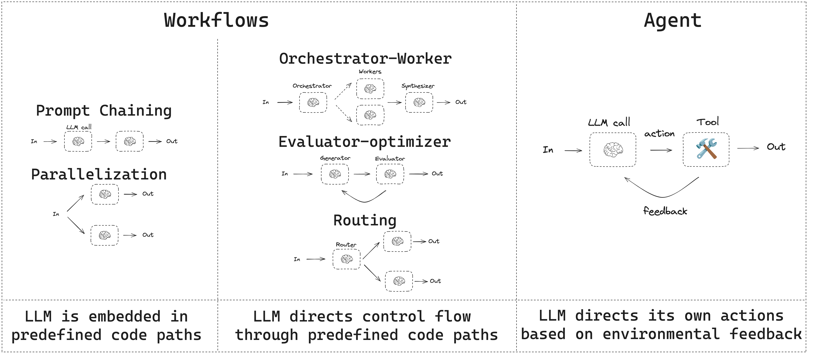
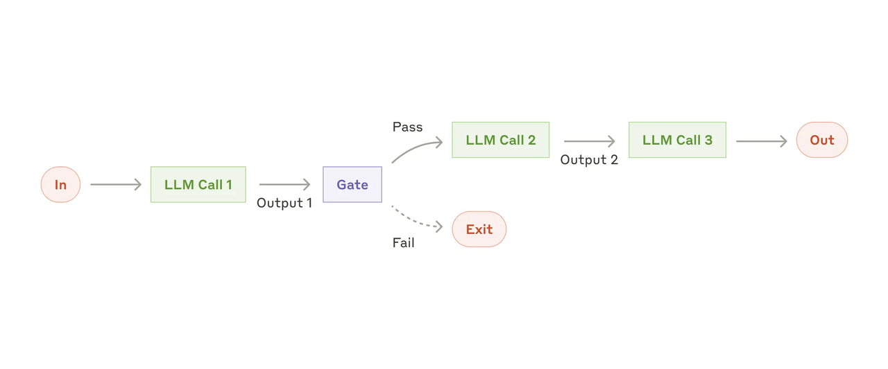
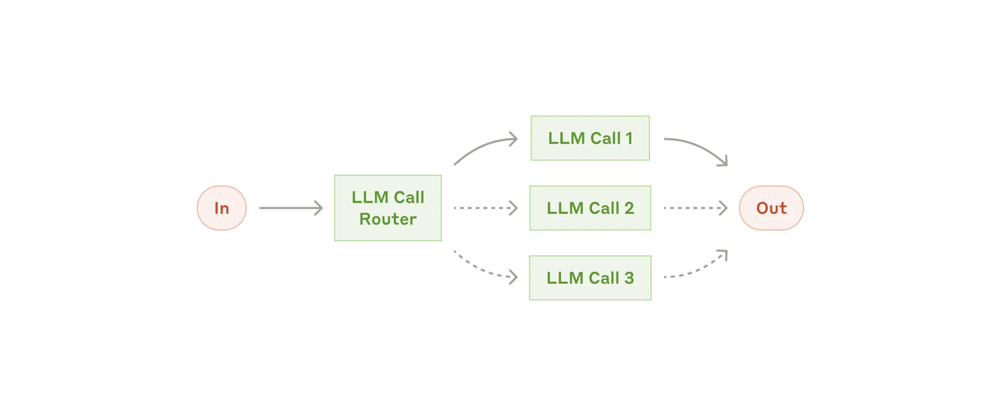
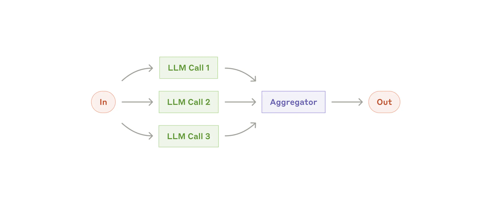
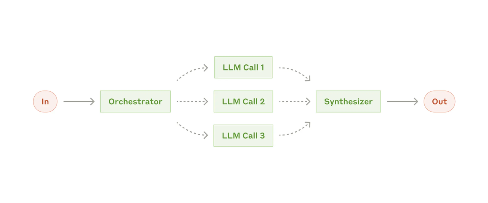
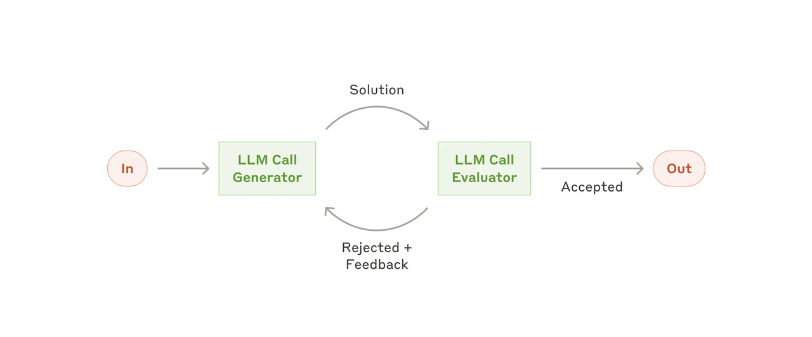
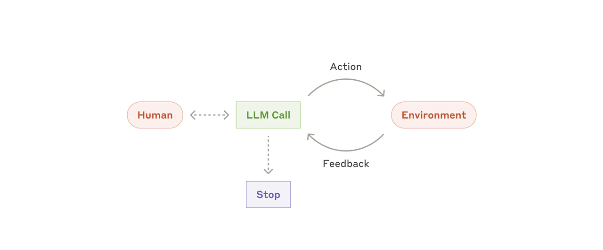
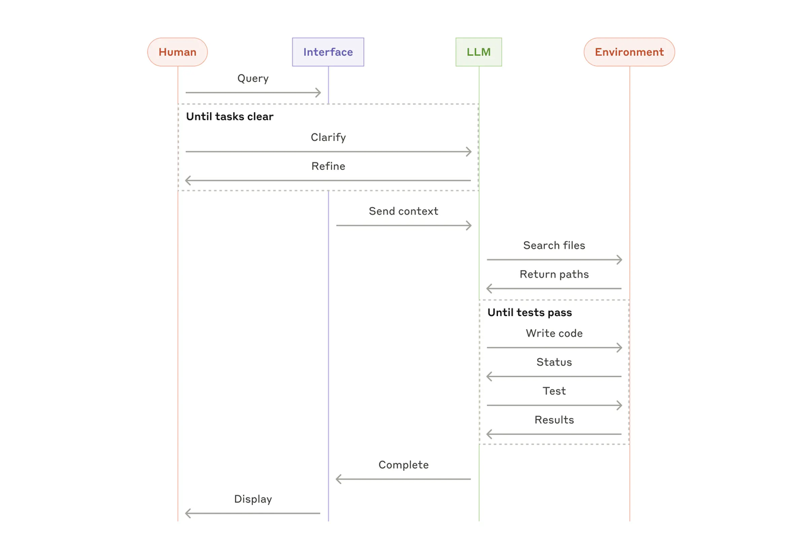

# Workflow & Agents

## 背景
在该章节中，我们导入了 [《Claude：Building effective agents》](https://www.anthropic.com/engineering/building-effective-agents) 一文。其不仅概述了不同于 OpenAI 的 Agents 定义，还概括了多种 Workflow 和 Agents 的实现方式和架构。我们采用 LangChain & LangGraph 框架作为文章提到的多种架构的实现框架，并以代码的形式展示每种架构的异同。在此之前，我们先快速了解下该文的三个问题导入：<br>
<br>

**1. 什么算一个 Agent？**

> 在 [01_simple_tool_use_agent/intro.md](../01_simple_tool_use_agent/intro.md) 中，我们介绍了 OpenAI 对 Agent 的定义：“基于 LLM 驱动并能够与外部系统进行交互，使用工具的系统定义为 Agent”。

而在 Anthropic（Claude）中则给出了更严谨的界限：

  *在 Anthropic，将所有的 Agent 定义变体归类为：Agentic Systems，但在 Workflows 和 Agents 之间划出了一个重要的架构区别：*<br>
    - *Workflow 是通过预定义代码路径协调 LLM 和工具的系统；*<br>
    - *Agents 是 LLM 动态指导其自身流程和工具使用的系统，可以控制其完成任务的方式。*<br>

以下有一种简单的方式来可视化这些差异：


> By the way，吴恩达教授对此类的定义是：都属于 Agent，只是分配给 Agent 灵活度、可控度不同，想象为一个滑动窗口。一个预定义的代码路径（Workflow），只是滑动窗口的最小值，但仍然是 Agent。

**2. 何时（以及何时不）使用 Agents？**

一段话概括：先找最简单的解决方案，例如只是简单的 Chat，并且仅在需要时增加复杂性。因为 Agent 系统通常会牺牲延迟和成本来换取更好的任务性能，当业务场景足够复杂，没办法满足任务预期的时候，Workflows 可以为定义明确的任务提供可预测性和一致性；而当需要大规模灵活性和模型驱动的决策时，构建Agents 则是最好的选择。

**3. 何时以及如何使用框架？**

本教程采用 LangChain 结合 LangGraph 作为代码实现的基本框架，但也有许多值得了解的其他框架，例如 CrewAI、OpenAI-Agents-SDK 等。这些框架使 Agents 系统更易于实现，简化了标准的低级任务，例如 LLM 调用、定义和解析工具以及链调用，从而简化了入门流程。

然而，它们通常会创建额外的抽象层，这可能会掩盖底层的提示和响应，使其更难调试。此外，它们还可能让人倾向于增加复杂性，而一些任务实际上不依赖于框架反而可以通过更简单的设置或编码来完成。

**在该文章中，Anthropic 总结了五种 Workflow（预定义执行链）架构，并给出了 Agents 架构的清晰定义。这五种 Workflow 架构分别是：提示链、路由、并行化、协调者-工作者、评估器-优化器。我们将围绕这五种 Workflow 架构和 Agents，通过 LangChain 和 LangGraph 做对应的实现示例，并针对每一种架构提供两种基于框架的实现方式！！！接下来，让我们快速开始，如果你想了解每个架构的异同，建议优先阅读 本文档中的基本方法解析部分。**

## 快速开始
在本教程中，我们针对每一种架构都提供了基于图编排（Graph）和基于函数定义（Functional）的两种实现方式！建议你在了解每一种架构的基本概念后，深入阅读每一种架构的两种实现方法，相信你定有所收获！

### 1. 设置环境变量
在本章节中，我们不仅对每一种架构的图编排（Graph）实现方案进行了可视化，你可以参考每个子目录下的 `graph_visualization.mmd` 文件。此外，我们将会利用 `LangSmith` 来链路追踪每一份代码的执行路径，这些都对我们了解 Workflow/Agents 的执行逻辑和检查内部发生了什么有很大帮助！

> 当然，在实际开发中，我也建议你这么做！这同样能够帮助你根据链路信息调试代码！

首先，我们将通过 [LangSmith 官网](https://smith.langchain.com/) 进行注册，并创建 `project`，接着获取 `API Key`（这里不逐步演示，当你点进去，你自然该知道怎么做！）。

随后，我们设置环境变量并启动链路追踪：
```bash
$ cp .env.example .env
```
在 `.env` 文件中设置 `LANGSMITH_TRACING`(启用链路追踪)、`LANGSMITH_ENDPOINT`(LangSmith 服务地址)、`LANGSMITH_API_KEY`(LangSmith API Key)、`LANGSMITH_PROJECT`(LangSmith 项目名称)，以及 `OPENAI_API_KEY` 和 `OPENAI_BASE_URL`。
```bash
LANGSMITH_TRACING=true
LANGSMITH_ENDPOINT="https://api.smith.langchain.com"
LANGSMITH_API_KEY="..."
LANGSMITH_PROJECT="..."

TAVILY_API_KEY="..."
OPENAI_BASE_URL="..."
OPENAI_API_KEY="..."
```

### 2. 运行代码
请按照以下格式运行每一种架构实现，其中 `${sub_dir}` 为 子目录名称，例如你要运行提示链架构，请执行：`$ python ./prompt_chaining/functional_api.py` 或者 `$ python ./prompt_chaining/graph_api.py`。
```bash
$ python ./${sub_dir}/functional_api.py # 函数式实现
$ python ./${sub_dir}/graph_api.py # 图编排实现(会产出可视化图)
```
随后，你可以在 LangSmith 上查看链路追踪信息，包括 LLM 接收到的具体提示，以及 Tokens 使用情况、延迟、模型参数等。

## 基本方法解析
### 1. Workflow：提示链
提示链将任务分解为一系列步骤，其中每个 LLM 调用都会处理前一个步骤的输出。在系统实现上，可以在任何中间步骤上添加程序化检查（例如下图中的“Gate”），以确保流程仍在正常进行。

> 何时使用此工作流：提示链非常适合任务可以轻松清晰地分解为固定子任务的情况。其主要目标是通过简化每次 LLM 调用，以降低延迟并提高准确率。

### 2. Workflow：路由
路由会对输入进行分类，并将其定向到专门的后续任务。此工作流程允许分离关注点，并构建更专业的提示。如果没有此工作流程，针对一种输入进行优化可能会损害其他输入的性能。

**For Example：**
- 将不同类型的客户服务查询（一般问题、退款请求、技术支持）引导到不同的下游流程、提示和工具中；
- 将简单/常见问题路由到较小的模型（如 Claude 3.5 Haiku），将困难/不寻常的问题路由到功能更强大的模型（如 Claude 3.5 Sonnet），以优化成本和速度。
> 何时使用此工作流： 路由非常适合复杂任务，其中存在不同的类别，最好分别处理，并且可以通过 LLM 或更传统的分类模型/算法准确处理分类。

### 3. Workflow：并行化
LLM 有时可以同时处理一项任务，并以编程方式聚合其输出。这种工作流程（即并行化）体现在两个关键变化中：
- 分段：将任务分解为并行运行的独立子任务；
- 投票：多次运行相同的任务以获得不同的输出。

For Example：
- 切片：
  - 在进行综述生成时，通常会递归地从最小子章节生成到顶级章节。而对于同级章节或多个最小子章节，可以采用并行化处理，以提供整体综述生成速度；
  - 自动化评估LLM性能，通过对每个清晰定义的流程并行化，并不断地更换每一序列的中间结果，以自动化评估整个工作流中哪一节点对现质量的影响是最巨大的。
- 投票：
  - 审查一段代码是否存在漏洞，如果发现问题，几个不同的提示会审查并标记代码；
  - 评估给定的内容是否不适当，使用多个提示评估不同的方面或要求不同的投票阈值来平衡误报的阳性和阴性。
> 何时使用此工作流： 当拆分后的子任务可以并行化以提高速度，或者需要多个视角或尝试以获得更高置信度的结果时，并行化非常有效。对于涉及多个考量的复杂任务，当每个考量都由单独的 LLM 调用处理时，LLM 通常表现更好，从而能够专注于每个特定方面。

### 4. Workflow：协调者-工作者
在协调者-工作者的工作流中，中央LLM动态分解任务，将其委托给工作者LLM，并综合其结果。

For Example：
- 每次对多个文件进行复杂更改的编码产品；
- 搜索任务涉及从多个来源收集和分析信息以获取更多可能相关的信息；
> 何时使用此工作流： 此工作流非常适合无法预测所需子任务的复杂任务（例如，在编码过程中，需要更改的文件数量以及每个文件的更改性质可能取决于任务本身）。虽然它在拓扑结构上与并行化类似，但其与并行化的关键区别在于灵活性——子任务并非预先定义，而是由编排器根据具体输入确定。

### 5. Workflow：评估器-优化器
在评估器-优化器工作流中，一个 LLM 调用生成响应，而另一个调用在循环中提供评估和反馈。

For Example：
- 文学翻译中存在一些细微差别，翻译器最初可能无法捕捉到，但评估器可以提供有用的批评。
- 复杂的搜索任务需要多轮搜索和分析才能收集全面的信息，评估器将决定是否需要进一步搜索。
> 何时使用此工作流： 当我们拥有清晰的评估标准，并且迭代改进能够提供可衡量的价值时，此工作流程尤其有效。良好契合的两个标志是：首先，当人类清晰地表达反馈时，LLM 的答案可以得到显著的改进；其次，LLM 能够提供这样的反馈。这类似于人类作家在撰写一篇精良文档时可能经历的迭代写作过程。

### 6. Agents：Agent
Agents 可以处理复杂的任务，但它们的实现通常很简单。它们通常只是基于环境反馈循环使用工具的 LLM。因此，清晰周到地设计工具集及其文档至关重要。

For Example：
- Coding Agents：

> 何时使用Agent： Agent 可用于解决开放式问题，这类问题难以甚至无法预测所需的步数，并且无法硬编码固定路径。LLM 可能会运行多轮，所以必须对其决策有一定程度的信任，并不断改进系统设计、代码来尽可能保证稳定性。Agent 的自主性使其成为在可信环境中扩展任务的理想选择。

### 总结：
在 LLM 领域取得成功，并非在于构建最复杂的系统，而是在于构建符合自身需求的系统。从简单的提示开始，通过全面的评估进行优化，只有在简单的解决方案无法满足需求时，才添加多步骤的代理系统。
在实现Agent时，尝试遵循三个核心原则：
1. 保持 Agent 设计的简单性；
2. 通过明确展示 Agent 的计划步骤来优先考虑透明度；
3. 构建全面的工具文档并精心设计 Agent-Computer Interface（ACI）。

## 备注
如果你的代码运行不通，请按照 `依赖 -> 环境（base_url、api_key） -> 模型提供商设置 -> 中转网站日志查看是否有请求进来` 的顺序检查代码。<br>
如若还是没办法解决，欢迎在 [CodeDriver/AICourse](https://github.com/CodeDriverTech/AICourse) 内提交 Issue，或联系作者邮箱: JHxu77@gmail.com。如果你是牧码南山成员应该可以在飞书群或通过学长学姐联系到我，期待你的来信！<br>

**当然，你成功的解决了某个 Bug，或觉得文档有误 or 需要补充。欢迎你进行 Contribution，一起完善课程，让更多的同学受益！！**